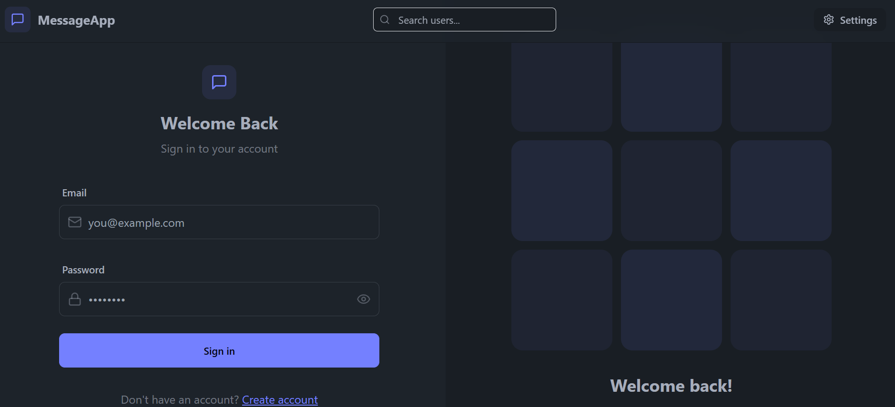
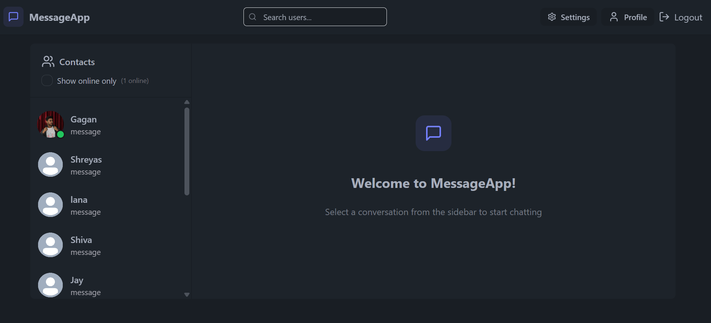
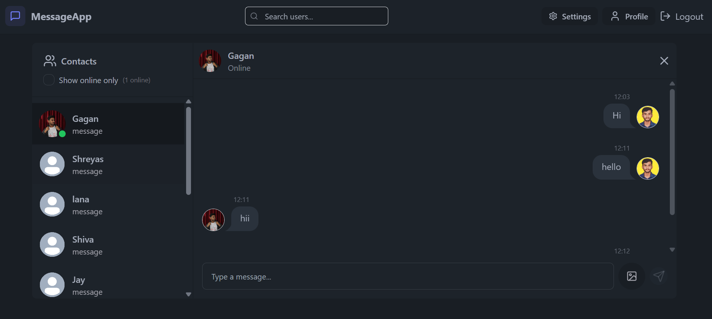
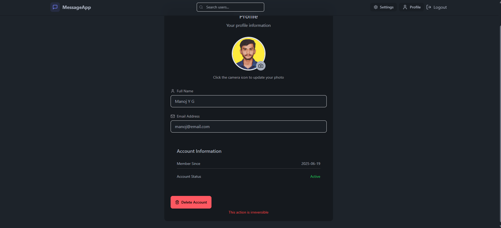

# ✨ Full Stack Realtime Chat App ✨

A fully functional, real-time chat application built with the **MERN stack**, **Socket.IO**, and styled using **TailwindCSS + Daisy UI**. Includes secure authentication, real-time communication, media sharing, and deployment readiness.

---

## 🚀 Features

- 🌟 **Tech Stack:** MongoDB, Express.js, React.js, Node.js (MERN)
- 🔐 **Authentication & Authorization:** JWT-based secure login/register
- 👾 **Real-time Messaging:** Powered by Socket.IO
- 🟢 **Online User Status:** See who is currently online
- 🌍 **Global State Management:** Zustand for clean state control
- 🌈 **UI:** Responsive layout with TailwindCSS and Daisy UI
- 🐞 **Robust Error Handling:** On both client and server sides
- 📦 **Cloudinary Integration:** For image uploads
- 📄 **Environment Config:** Easy-to-setup `.env` system
- 🚀 **Production-Ready Deployment:** Build scripts and config included

---









## 🧭 Pages Overview

| Page               | Path            | Description |
|--------------------|-----------------|-------------|
| **🔐 Register**    | `/register`     | Create a new user account |
| **🔐 Login**       | `/login`        | Secure login using JWT |
| **🏠 Home**        | `/home` or `/`  | Main dashboard after login |
| **💬 Chat Room**   | `/chat/:id`     | One-on-one real-time chat with Socket.IO |
| **👥 Chat List**   | `/chats`        | List of conversations |
| **👤 Profile**     | `/profile/:id`  | View user profile |
| **✏️ Edit Profile**| `/edit-profile` | Update avatar and bio |
| **🚫 404**         | `*`             | Not Found route |

---

## ⚙️ Environment Configuration

Create a `.env` file in the `backend/` directory:

```env
MONGODB_URI=your_mongodb_connection_string
PORT=5001
JWT_SECRET=your_jwt_secret

CLOUDINARY_CLOUD_NAME=your_cloud_name
CLOUDINARY_API_KEY=your_cloudinary_api_key
CLOUDINARY_API_SECRET=your_cloudinary_api_secret

NODE_ENV=development


#!/bin/bash

echo "🚀 Starting setup for Full Stack Realtime Chat App..."

# Step 1: Clone the repository (optional, if not already cloned)
# echo "📦 Cloning repository..."
# git clone https://github.com/your-username/fullstack-chat-app.git
# cd fullstack-chat-app

# Step 2: Install backend dependencies
echo "📁 Installing backend dependencies..."
cd backend
npm install

# Step 3: Create .env file if it doesn't exist
if [ ! -f ".env" ]; then
  echo "⚙️ Creating backend .env file..."
  cat <<EOF > .env
MONGODB_URI=your_mongodb_connection_string
PORT=5001
JWT_SECRET=your_jwt_secret

CLOUDINARY_CLOUD_NAME=your_cloud_name
CLOUDINARY_API_KEY=your_cloudinary_api_key
CLOUDINARY_API_SECRET=your_cloudinary_api_secret

NODE_ENV=development
EOF
  echo "✅ .env file created. Please update it with real credentials."
else
  echo "✅ .env file already exists."
fi

# Step 4: Start backend server
echo "🚀 Starting backend server..."
npm run dev &
BACKEND_PID=$!
cd ..

# Step 5: Install frontend dependencies
echo "📁 Installing frontend dependencies..."
cd frontend
npm install

# Step 6: Start frontend server
echo "🚀 Starting frontend server..."
npm run dev &
FRONTEND_PID=$!

# Summary
echo "🎉 Setup complete!"
echo "👉 Backend running on http://localhost:5001"

# Optional: Wait for both servers to keep the script open
wait $BACKEND_PID $FRONTEND_PID


